### Author: Amogha A Halhalli

# PART 1: Gradient Descent and Variants
- Import all the required libraries for the implementation.
- Used 42 as the random seed for the entire notebook.

### The Algorithm
- Implemented a class for the Rosenbrock and other given function.
- Created different function for each variant of the Gradient Descent.
- Using 1e4 as the number of iterations for each of the algorithm.
- Used 1e-06 as the tolerance to check the convergence of each algorithm.
- Implemented functions to find the function value and its gradient at any point.

### Running the algorithm
- Randomly choose the starting point between -1 and 1.
- Used 0.001 as the learning rate and 0.9 as momentum for Polyak's momentum method.
- Used 0.9 as the momentum for Nesterov accelerated gradient descent.
- used 0.999 as gamma value and 0.9 as the delta value for the Adam optimizer.
- Plotted the contour plot using arrow to show the movement after each update.

### ROSENBROCK FUNCTION f(x, y) = x^2 + 100(y-x^2)^2
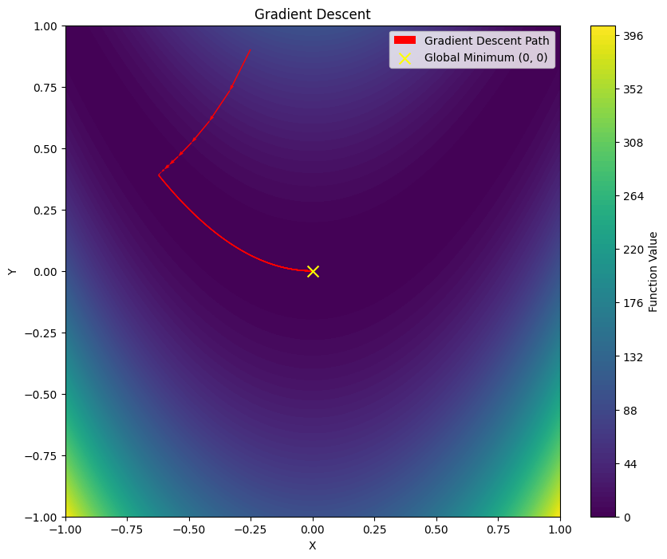
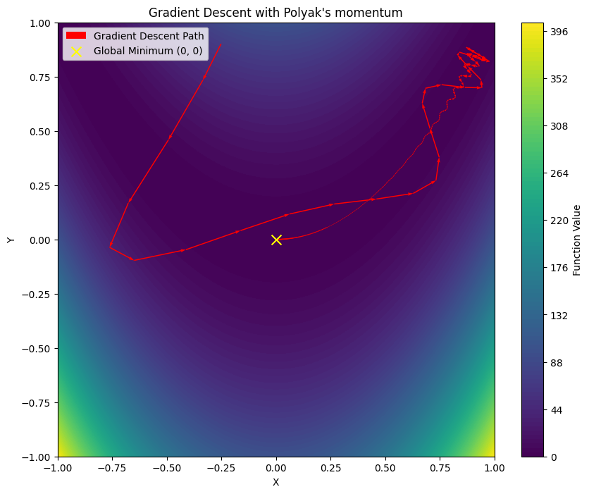

### FUNCTION f(x, y) = (50/9)(x^2 + y^2)^3 − (209/18)(x^2 + y^2)^2 + (59/9)(x^2 + y^2)

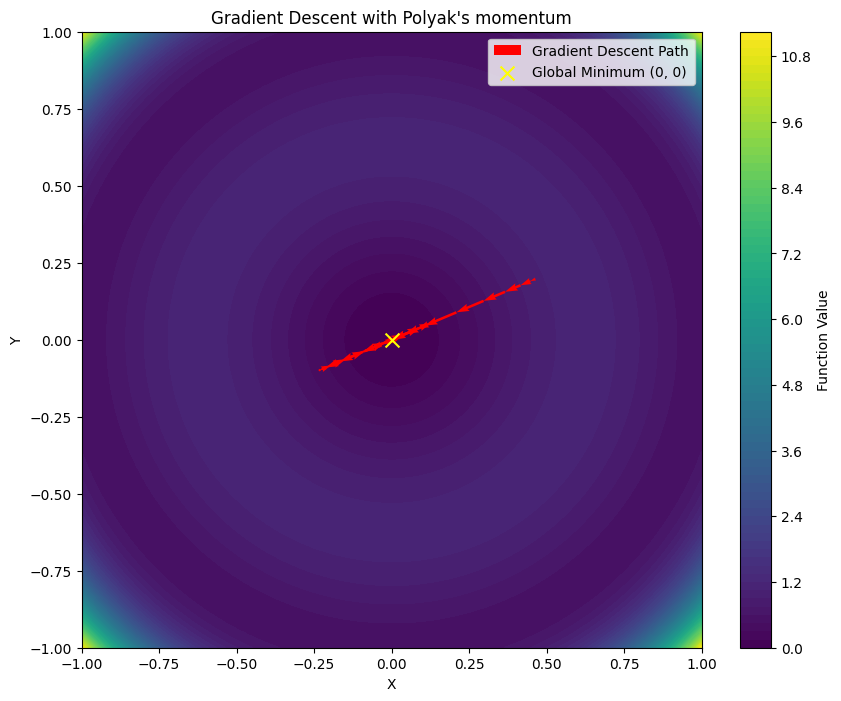
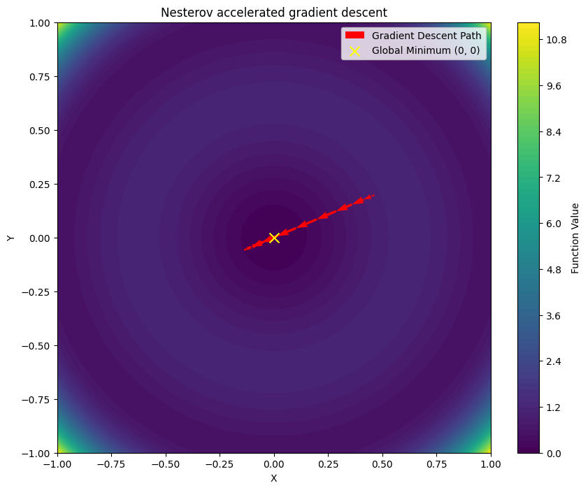
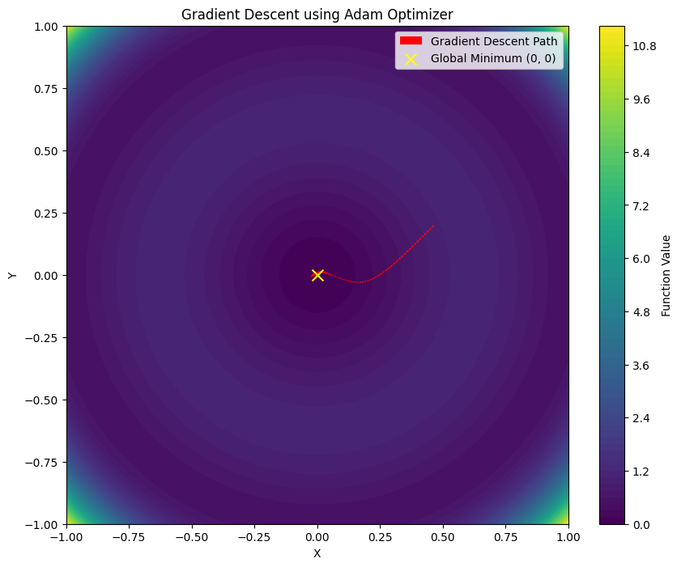

# PART 2: Back Propagation, Resilient Propagation (RProp) and QuickProp
- Import all the required libraries for the implementation.
- Used 42 as the random seed for the entire notebook.

### Getting the data and Data preprocessing
- Downloaded the Concrete Compressive Strength dataset from the link below.
- Link: https://archive.ics.uci.edu/dataset/165/concrete+compressive+strength
- Extracted the zip file and placed the Concret_Data.xls file in the directory containing the notebook.
- Loaded the data form the file and split the data into train and test data with train size = 0.7
- Both the dependent and independent data are normalized to make sure data lies within a given range.
- Normalization was done in order to avoid the integer overflow during the weight updates.

### The Algorithm
- Created a class which takes algorithm, number of layers and activation function as parameters.
- The weights, delta weights and previous gradients are intialised randomly in the class.
- Used Mean Squared Error(MSE) as the loss function and 0.001 as the learning rate.
- Each network is trained for 1e3 epochs irrespective of the convergence is achieved or not.
- Implemented separate methods to update weights incase of BackProp, RProp and QuickProp.

### Running the Algorithm
- Used BackPropagation, Resilient Propagation and QuickProp as the three algorithms.
- Used tanh, LeakyReLU as the activation functions and 25 or 50 hidden units in each network.
- Trained each of the triplet (algorithm, number of layers, activation function).
- Graphs of MSE vs number of epochs is plotted for train and test data for each network.
- Also, indicated the loss, epochs to convergence, time for each network in a table.

### The Results
- From the data obtained we can conclude that BackProp takes less time and is optimized algorithm.
- Using 50 hidden layers leads to earlier convergence as compared to 25 hidden layers.
- Leaky ReLU has lower loss in BackProp and QuickProp whereas tanh has lower loss in case of RProp.
- So, the choice of activation function depends on specific problem and the architecture of the network.

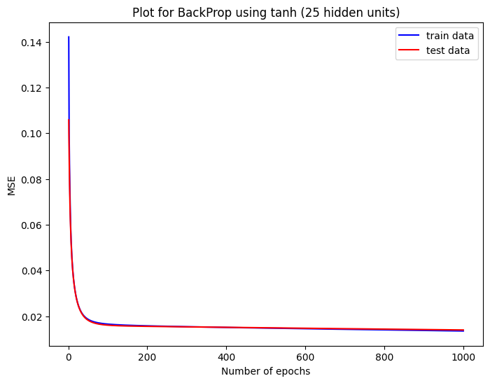
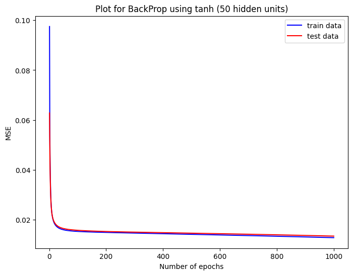
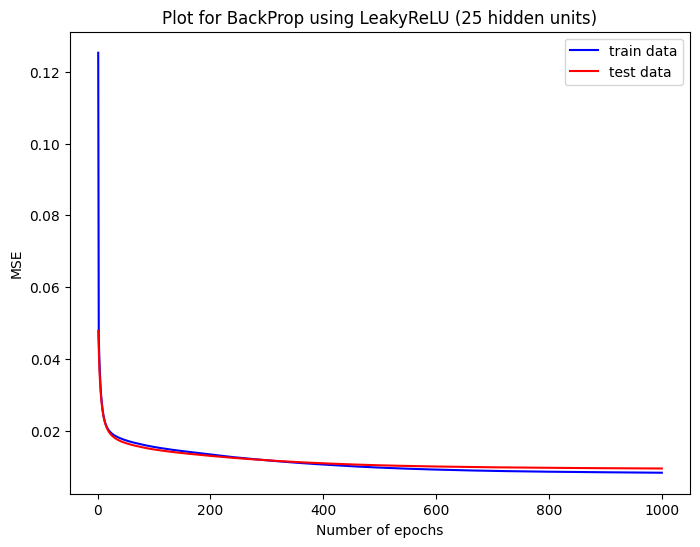
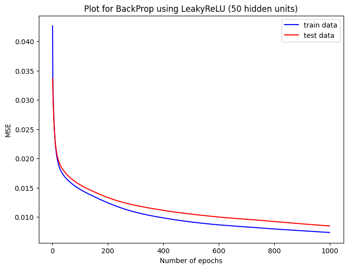
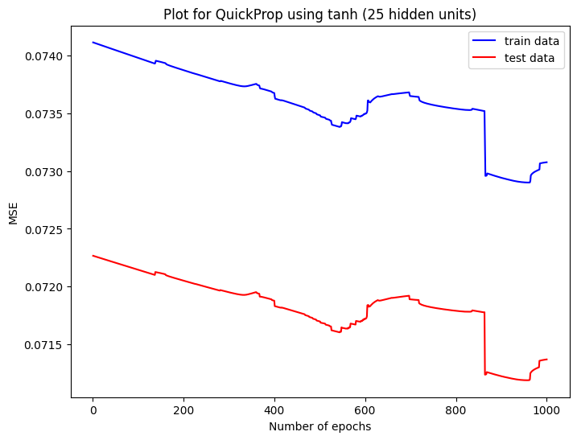
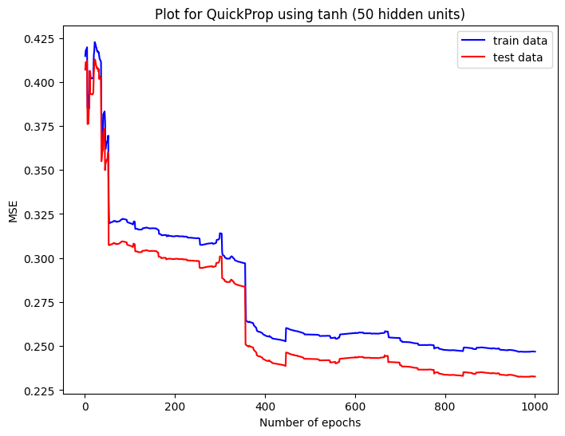
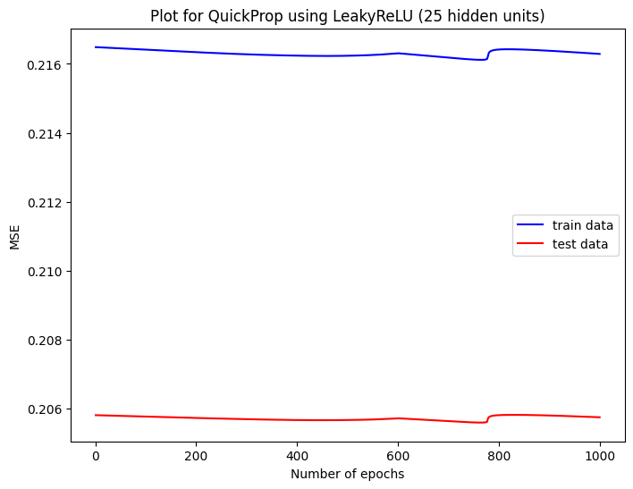
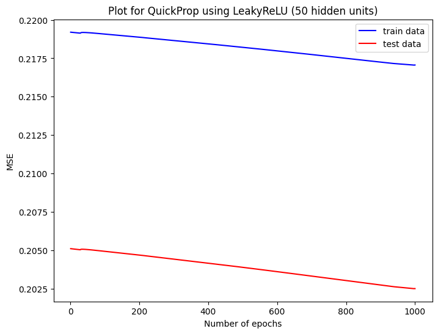
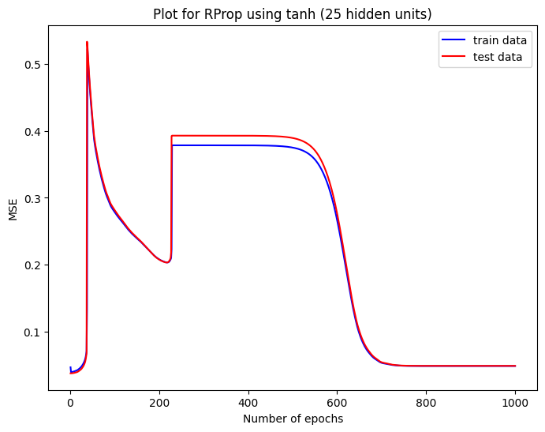
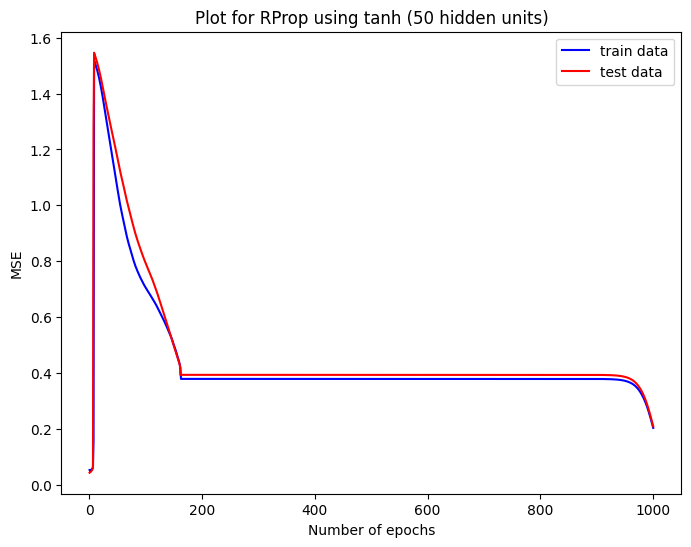
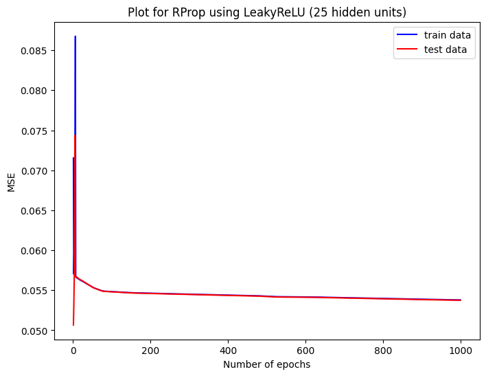

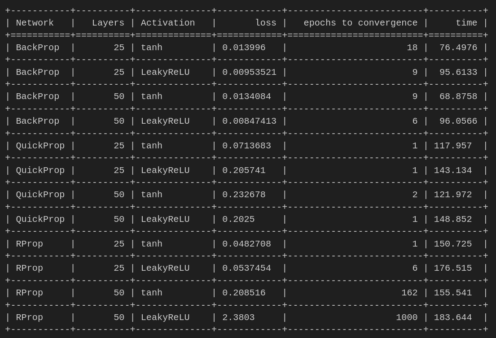